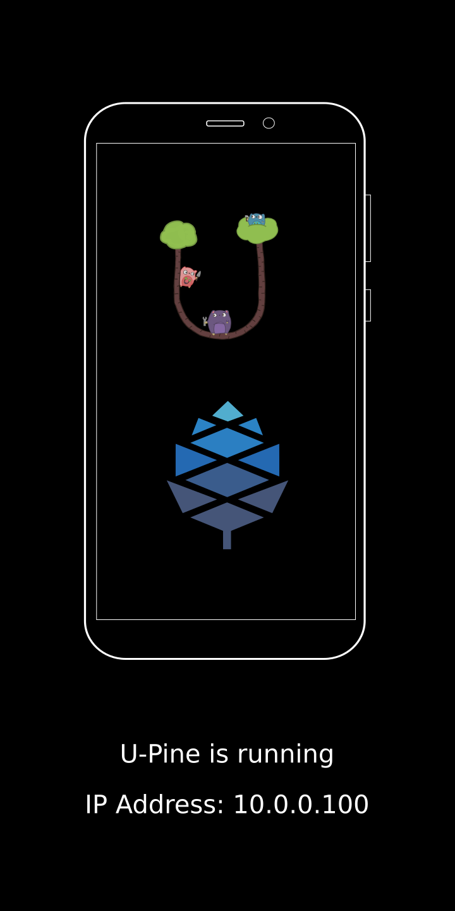

U-Pine (naming is WIP)
--------------------

U-Pine is a ramdisk image that provides direct access to eMMC/SDCard storage to setups up a network-over-usb connection with a Pinephone.

Just like [Jumpdrive](https://github.com/dreemurrs-embedded/Jumpdrive) but on Golang!

## Features

- [x] eMMC/SDCard access
- [x] Network-over-usb
- [x] SSH access
- [ ] Bootloader
- [ ] Netboot

# User Guide

1. To get a predictable name for Pinephones usb network inteface copy and init udev rules:
```
$ cp configs/99-pinephone.rules
$ udevadm control --reload-rules
$ udevadm trigger
```

2. Setup `pine0` network connection
```
$ nmcli con mod pine0 ipv4.addresses 10.0.0.1/24
$ nmcli con mod pine0 ipv4.gateway 10.0.0.1/24
$ nmcli con mod pine0 connection.autoconnect yes
```

3. By default `~/.ssh/id_rsa.pub` key will be embedded into the boot image. To connect over SSH run the following command:
```
$ ssh -o PubkeyAcceptedKeyTypes=+ssh-rsa -o HostkeyAlgorithms=+ssh-rsa -p 2022 root@10.0.0.100
```

## Boot flow | Screenshot

 | 

## Building

1. Install dependecies (Fedora)
```
$ dnf install git gcc-aarch64-linux-gnu openssl-devel golang mtools dosfstools parted
```

1. Build image
```
make pinephone-uroot.img
```

3. Flash image into SD Card
```
sudo dd if=pinephone-uroot.img of=/dev/<sdcard_device> bs=1M status=progress conv=fsync
```

## Development

`jumpdrive` runs as part of init process of the ramdisk and located in `/jumpdrive` directory.

Ramdisk is build on top of u-root - busybox with a minimal set of commands written on Go.

To become more familiar with u-root, check out it's [Github page](https://github.com/u-root/u-root) and [LinuxBoot](https://github.com/linuxboot/book/blob/master/u-root/README.md) chapter.

## References
- [Jumpdrive](https://github.com/dreemurrs-embedded/Jumpdrive) -  Flash/Rescue SD Card image for PinePhone and PineTab
- [xnux](https://xnux.eu/devices/pine64-pinephone.html) - Pinephone kernel development and optimization
- [u-root](https://github.com/u-root/u-root) - A fully Go userland with Linux bootloaders

## Logos
- PINE64 and the PINE64 pinecone logo are trademarked by Pine Store Limited. The trademark extends to the PINE64 brand name in writing, the PINE64 pinecone logo (referred to as logo in the document) and in some instances also to logo derivatives.
- The Go gopher was designed by Renee French.
- The u-root logo design is licensed under the Creative Commons 3.0 Attributions license.